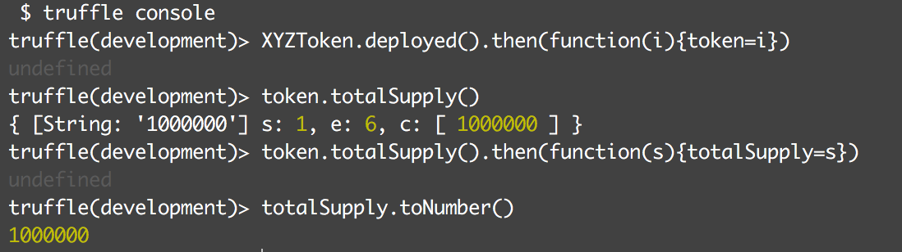
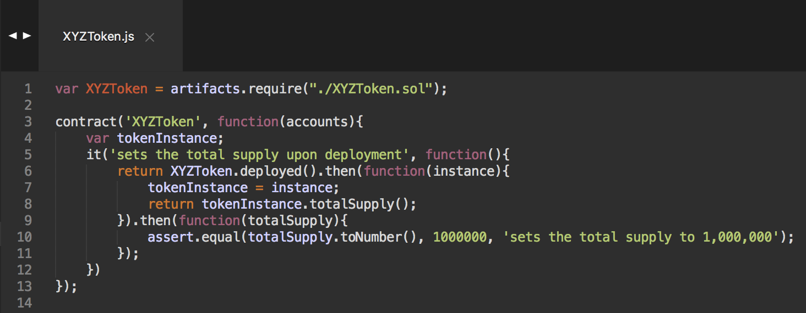

# Dapp, Truffle: ERC20 Token

- Links:
	- [Code Your Own Cryptocurrency on Ethereum, Dapp University, YouTube](https://www.youtube.com/watch?v=W0Lomo8CdTM&list=PLS5SEs8ZftgWFuKg2wbm_0GLV0Tiy1R-n)
	- [ERC-20 Token Standard](https://github.com/ethereum/EIPs/blob/master/EIPS/eip-20.md)

- Tools:
	- Truffle: framework to create dapps on the ethereum network
	- Web3 JS: enables client side app to talk to the blockchain 
	- Metamask: enables browser to talk to the blockchain 
	- Ganache: local development blockchain 
	- Geth

- Sections:
	- Part 1: Back-end
	- Part 2: Front-end
	- Part 3: Deployment 

## Part 1: Back-end
- Project Setup: truffle init, truffle.js (project configuration--how it'll connect to the local blockchain)
- Test setup
	- Contract
	
	- Console
	
	- Test
	
- Create Token Contract
	- 3: Edit totalSupply, implement balanceOf, allocate initialSupply to admin, assign token name, symbol and standard
	- 4: Add transfer function
	- 5 - 6: Implement delegated transfer (transferFrom, approve, allowance)

