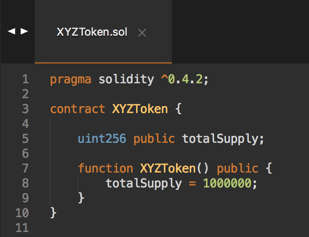

# Dapp, Truffle: ERC20 Token

- Links:
	- [Code Your Own Cryptocurrency on Ethereum, Dapp University, YouTube](https://www.youtube.com/watch?v=W0Lomo8CdTM&list=PLS5SEs8ZftgWFuKg2wbm_0GLV0Tiy1R-n)
	- [ERC-20 Token Standard](https://github.com/ethereum/EIPs/blob/master/EIPS/eip-20.md)

- Tools:
	- Truffle: framework to create dapps on the ethereum network
	- Web3 JS: enables client side app to talk to the blockchain 
	- Metamask: enables browser to talk to the blockchain 
	- Ganache: local development blockchain 
	- Geth

- Sections:
	- Part 1: Back-end
	- Part 2: Front-end
	- Part 3: Deployment 

## Part 1: Back-end
- Project Setup: truffle init, truffle.js (project configuration--how it'll connect to the local blockchain)
- Test setup
	- Contract

	
	- Console

	
	- Test
	
	
- Create Token Contract
	- 3: Edit totalSupply, implement balanceOf, allocate initialSupply to admin, assign token name, symbol and standard
	- 4: Add transfer function
	- 5 - 6: Implement delegated transfer (transferFrom, approve, allowance)
- Create Token Sale Contract
	- Assign an admin, set token price in wei, provision tokens to token sale contract, buy tokens, end sale
	- 8: Assign admin, import and access the token contract, set a token price in wei
	- 9: Buy tokens, provision tokens to token sale contract (take some of the tokens from the token contract and transfer it to the token sale contract) 
	- 10: End Sale

## Part 2: Front-end
- 11: Environment Setup
- 12: Layout for website (index.html), app.js (init, initWeb3, initContracts, load account data in render function)
- 13: Render function, buyTokens, transfer some tokens from the token contract to the token sale contract from the console, add listenForEvents function

## Part 3: Deployment
- 14: Deploy to the Rinkeby test network
- Install geth: https://github.com/ethereum/go-ethereum/wiki/Installation-Instructions-for-Mac (check: which geth, geth version)
- Start geth:  geth --rinkeby --rpc --rpcapi personal,db,eth,net,web3 --ipcpath “~/Library/Ethereum/geth.ipc”
- Sync
	- Start geth console: geth attach http://127.0.0.1:8545
	- Check progress: eth.syncing (Can view the blocks on Etherscan, rinkeby.etherscan.io)
	- exit 
- Create an account 
	- geth --rinkeby account new (specify the network, rinkeby in this case)
	- Output: Address: {6a52ebc9b74be6b4e990bd7ebd5a6c3798bd4667}
- Get some ether for the account from https://faucet.rinkeby.io/
- Check if the account was funded
	- Start geth console: geth attach http://127.0.0.1:8545
	- List accounts: eth.accounts 
	- Get balance of first account: eth.getBalance(eth.accounts[0])
- Configure project to deploy to the rinkeby test network 
	- Add configuration to truffle.js 

	
- Unlock account to deploy: personal.unlockAccount(eth.accounts[0],null, 1200)
	- null: the password
	- 1200 secs (20 mins): time you want to unlock the account for (expressed in seconds) 
- Migrate the contracts to the rinkeby test network: truffle migrate --reset --compile-all --network rinkeby
- Go to Etherscan (https://rinkeby.etherscan.io/) to check if the migration was successful (get the contract address from build -> contracts -> XYZToken.json (networks >> “4” >> “address”)
- Transfer some tokens from the token contract to the token sale contract using the geth console 
	- geth attach http://127.0.0.1:8545
	- var admin = eth.accounts[0]
	- var tokensAvailable = 750000
	- var tokenSaleAddress = ‘0xea33e3be78f60e3256f35d439395cd1e028746e6'
	- var tokenAddress = ‘0xab38cfd337d4457546816dfecae77392ba81745b’
	- var abi = 'get from XYZToken.json'(minify using https://www.browserling.com/tools/json-minify)
	- Use web3 to get a deployed instance of the contract: var tokenContract = web3.eth.contract(abi)
	- var tokenInstance = tokenContract.at(tokenAddress)
	- Get the name: tokenInstance.name()
	- Transfer: tokenInstance.transfer(tokenSaleAddress, tokensAvailable, { from: admin })
	- Check: tokenInstance.balanceOf(admin) (250000), tokenInstance.balanceOf(tokenSaleAddress) (750000)
- Connect client-side application to the smart contracts that are connected to the rinkeby test network 
	- List the accounts created with geth: ls -l ~/Library/Ethereum/rinkeby/keystore
	- Import the account (stored as a json file) to metamask

